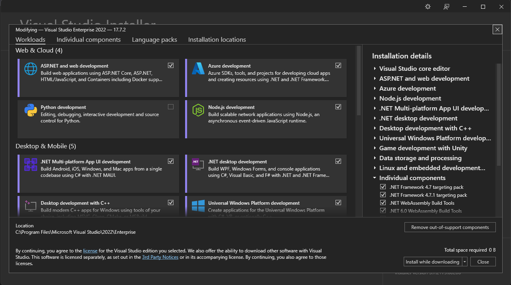
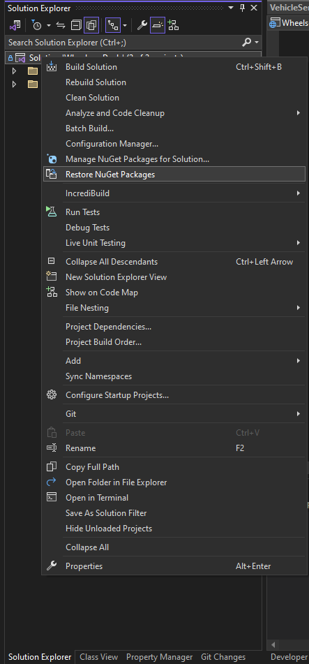
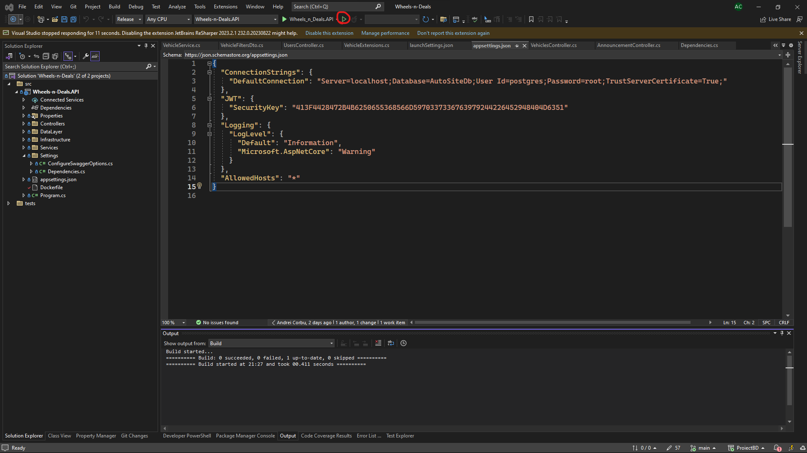

# Metoda 1 de instalare
1. Se descarca si se instaleaza ultima versiune de PostgreSQL(15.4)  - [click](https://sbp.enterprisedb.com/getfile.jsp?fileid=1258649)
2. In momentul instalarii postgres se seteaza parola userului postgres drept **root**
3. Se cloneaza repository-ul de pe GitHub
4. Se aplica back-up-ul bazei de date din fisierul *Wheels-n-Deals/backup.sql* folosind comanda `psql -U postgres < backup-windows.sql` din Command Prompt in interiorul folderului *Wheels-n-Deals*
5. Se descarca Visual Studio 2022 Enterprise Free Trial - [Click](https://visualstudio.microsoft.com/thank-you-downloading-visual-studio/?sku=Enterprise&channel=Release&version=VS2022&source=VSLandingPage&cid=2414&workload=dotnetwebcloud&flight=FlipMacCodeCF;35d&installerFlight=FlipMacCodeCF;35d&passive=false#dotnet)
6. Se porneste installerul VS2022
7. In fereastra Visual Studio Installer se selecteaza optiunile: ASP.NET and web development, .NET dekstop development

8. Se asteapta terminarea instalarii
9. Se descarca ultima versiune de Node LTS - [click](https://nodejs.org/en/download)
10. Se deschide Command Prompt cu drepturi de Administrator si se ruleaza comanda `npm install -g @angular/cli`
11. Se intra in folderul unde s-a clonat repo-ul, mai exact in folderul *Wheels-n-Deals/src/client* si se ruleaza comanda `npm install` pentru a instala toate dependintele proiectului
12. Se porneste Visual Studio dand double click pe fisieru *Wheels-n-Deals/Wheels-n-Deals.sln*
13. In meniul Solution Explorer se da click dreapta pe Solutia Wheels-n-Deals, iar apoi se selecteaza optiunea Restore Nugget Packages 
14. Din acelasi meniu ca la pasul *13* se selecteaza optiunea Build Solution
15. In interiorul Visual Studio se foloseste combinatia de taste CTRL + F5 pentru pornirea aplicatiei sau se apasa pe urmatorul buton din bara de sus 
16. Daca parola userului postgres este diferita de root se modifica parola si/sau userul din connection string din fisierul appsettings.json(*deschis in poza de la pasul 15*)
17. Se navigheaza in fisierul *Wheels-n-Deals/src/client*, se deschide Command Prompt si se ruleaza comanda `ng serve --o`
18. Aplicatia va porni automat in browser-ul dumneavoastra la adresa http://localhost:4200/

# Metoda 2 de instalare
1. Se descarca Docker Desktop - [click](https://www.docker.com/products/docker-desktop/)
2. Se instaleaza Docker Desktop
3. Se cloneaza repository-ul pe pc-ul local si se navigheaza in folderul *Wheels-n-Deals/src*
4. Se deschide aplicatia Docker Desktop
5. Se deschide Command Prompt si se ruleaza comanda `docker-compose up` in interiorul folderului *Wheels-n-Deals/src*
6. Se aplica back-up-ul bazei de date folosind comanda `psql -U postgres -p 5433 < backup-docker.sql`  din Command Prompt in interiorul folderului *Wheels-n-Deals* 
7. Se repeta pasul 5
8. Se porneste aplicatia in browser accesand adresa http://localhost:4200/

Swagger link : http://localhost:8088/swagger/index.html